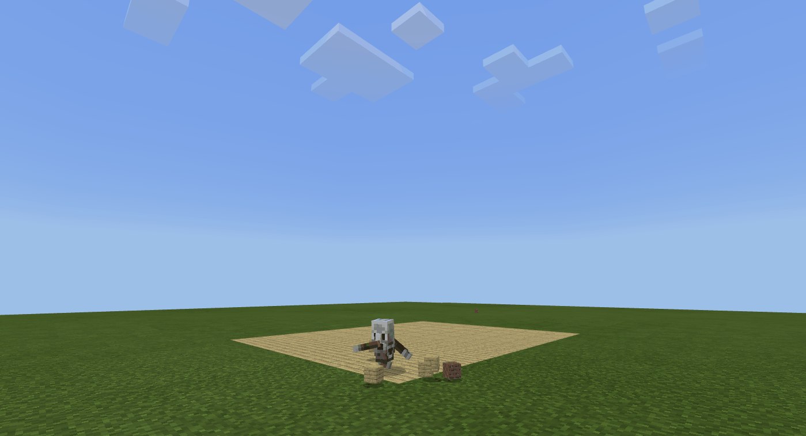

# Building a henhouse in Minecfart using MakeCode

Skrypt, który buduje kurnik. Gracz może parametryzować liczbę kur w kurniku.

### Uruchamianie:
* Załadować skrypt w Minecraft MakeCode (plik `henhouse.mkcd`)
* Wpisać w czat komendę `build n`, n to liczba kur w kurniku

#### Gif przedstawiający budowę:

